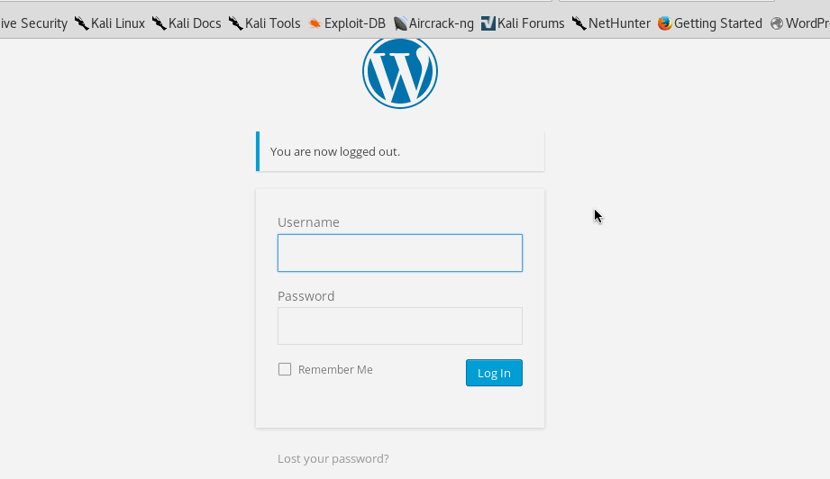
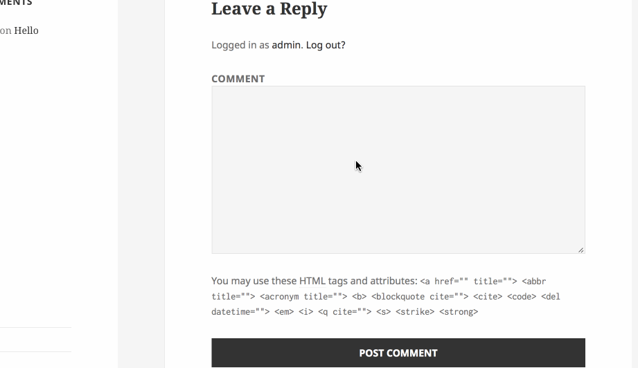

# web-security-week-7

Time spent: 12 hours spent in total

> Objective: Find, analyze, recreate, and document **five vulnerabilities** affecting an old version of WordPress

## Pentesting Report

1. (Required) Vulnerability Name or ID: Authenticated Stored Cross-Site Scripting
  - [ ] Summary:
    - Vulnerability types: XSS
    - Tested in version: 4.2
    - Fixed in version: 4.2.3
  - [ ] GIF Walkthrough:
    - 
  - [ ] Steps to recreate:
    - Create a new post, and then put this line of code in the content <a onmouseover="alert('I got you!')">Click here</a>, lastly click to preview the webpage.
  - [ ] Affected source code:
    - [Link 1](https://core.trac.wordpress.org/browser/tags/version/src/source_file.php)

2. (Required) Vulnerability Name or ID: User enumeration
  - [ ] Summary:
    - Vulnerability types: User enumeration
    - Tested in version: 4.2
    - Fixed in version: -
  - [ ] GIF Walkthrough:
    - 
  - [ ] Steps to recreate:
    - Go to the WordPress login page, when you randomly type an username, notification will appear invalid username, when you type admin as username and given random password guessing, the notification will say "the password for username admin is incorrect", so we know that it's a valid username. In this way we can make guess on other valid usernames.
  - [ ] Affected source code:
    - [Link 1](https://core.trac.wordpress.org/browser/tags/version/src/source_file.php)

3. (Required) Vulnerability Name or ID: Unauthenticated Stored Cross-Site Scripting
  - [ ] Summary:
    - Vulnerability types: XSS
    - Tested in version: 4.2
    - Fixed in version: 4.1.2
  - [ ] GIF Walkthrough:
    - 
  - [ ] Steps to recreate:
    - View one of the page, and scroll down to the comment section, inset the line of code in the comment: <abbr title='website alert' onmouseover='aler(404)' style='position:fixed;top:0;left:0;width:100%;height:100%'>. Then re-visit the page. The alert will pop out.
  - [ ] Affected source code:
    - [Link 1](https://core.trac.wordpress.org/browser/tags/version/src/source_file.php)

## Assets

List any additional assets, such as scripts or files

## Resources

- [WordPress Source Browser](https://core.trac.wordpress.org/browser/)
- [WordPress Developer Reference](https://developer.wordpress.org/reference/)

GIFs created with [LiceCap](http://www.cockos.com/licecap/).

## Notes

Describe any challenges encountered while doing the work

## License

    Copyright [2018] [Bohan Chen]

    Licensed under the Apache License, Version 2.0 (the "License");
    you may not use this file except in compliance with the License.
    You may obtain a copy of the License at

        http://www.apache.org/licenses/LICENSE-2.0

    Unless required by applicable law or agreed to in writing, software
    distributed under the License is distributed on an "AS IS" BASIS,
    WITHOUT WARRANTIES OR CONDITIONS OF ANY KIND, either express or implied.
    See the License for the specific language governing permissions and
    limitations under the License.
